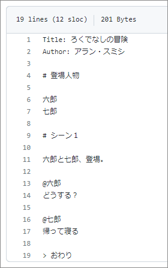
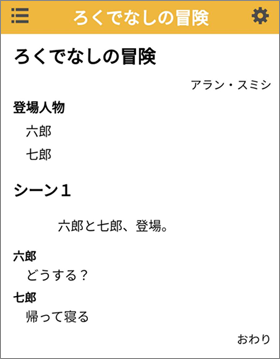

# pscapi

## 概要

[playscript](https://github.com/satamame/playscript) というパッケージの機能を API として提供するプログラムです。

- Doc: https://satamame.github.io/pscapi/

たとえば GitHub とかで台本を管理して、

それをスマホで読んだりするのに使えます。

## 機能

### フォーマット変換

- 入力は [Fountain (日本式)](https://satamame.github.io/playscript/master/fountain.html) または JSON 形式です。
    - sample フォルダにサンプルがあります (example.fountain, example.json)。
- 出力は PDF, HTML または JSON 形式です。
    - JSON 形式は [pscv (台本ビューア)](https://github.com/satamame/pscv) で使えます。

### Web 上のデータの取得

- Web 上にある台本データを、目的に応じたフォーマットで取得します。
- 取得元のフォーマットは Fountain (日本式) または JSON です。

## デプロイ

[FastAPI のドキュメント](https://fastapi.tiangolo.com/ja/deployment/) を参考にデプロイしてください。  
私が Deta にデプロイしたものを使って頂いても良いです。
- URL: https://j8bx8j.deta.dev
- Swagger UI: https://j8bx8j.deta.dev/docs

## APIs

API の仕様や呼び出し方の例は、[こちらのドキュメント](https://satamame.github.io/pscapi/) をご覧ください。  
sample フォルダにフォーマット変換をする JavaScript のサンプルがあります (index.html)。
